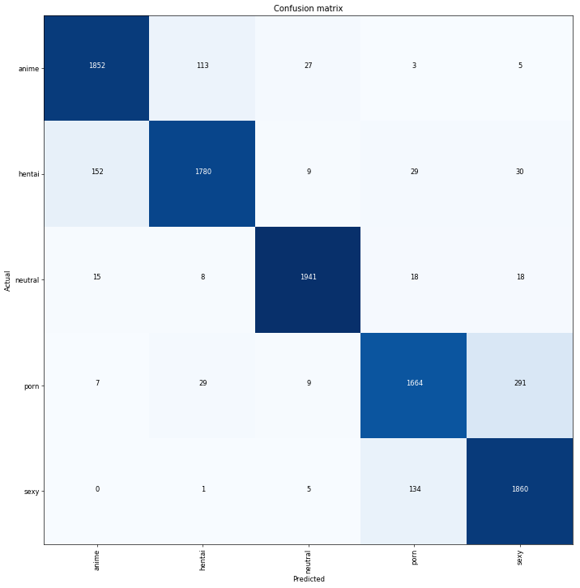

# NSFW Data Scrapper

## Description

This is a set of scripts that allows for an automatic collection of _10s of thousands_ of images for the following (loosely defined) categories to be later used for training an image classifier:
- `porn` - pornography images
- `hentai` - hentai images, but also includes pornographic drawings
- `sexy` - sexually explicit images, but not pornography. Think nude photos, playboy, bikini, beach volleyball, etc.
- `neutral` - safe for work neutral photos of everyday things and people
- `drawings` - safe for work drawings (including anime)

**Note**: the scripts have only been tested in Ubuntu 16.04 Linux distribution

Here is what each script (located under `scripts` directory) does:
- `1_get_urls.sh` - iterates through text files under `scripts/source_urls` downloading urls of images for each of the 5 categories above. The [Ripme](https://github.com/RipMeApp/ripme) application performs all the heavy lifting. The source urls are mostly links to various subreddits, but could be any website that Ripme supports.
*Note*: I already ran this script for you, and its outputs are located in `raw_data` directory. No need to rerun unless you edit files under `scripts/source_urls`
- `2_download_from_urls.sh` - downloads actual images for urls found in text files in `raw_data` directory
- `3_optional_download_drawings.sh` - (optional) script that downloads SFW anime images from the [Danbooru2018](https://www.gwern.net/Danbooru2018) database
- `4_optional_download_neutral.sh` - (optional) script that downloads SFW neutral images from the [Caltech256](http://www.vision.caltech.edu/Image_Datasets/Caltech256/) dataset
- `5_create_train.sh` - creates `data/train` directory and copy all `*.jpg` and `*.jpeg` file into it from `raw_data`. Also removes corrupted images
- `6_create_test.sh` - creates `data/test` directory and moves `N=2000` random files for each class from `data/train` to `data/test` (change this number inside the script if you need a different train/test split). Alternatively, you can run it multiple times, each time it will move `N` images for each class from `data/train` to `data/test`.

## Prerequisites
- Python3 environment: `conda env create -f environment.yml`
- Java runtime environment: 
   - Ubuntu linux:`sudo apt-get install default-jre`
- Linux command line tools: `wget`, `convert` (`imagemagick` suite of tools), `rsync`, `shuf`

## How to run
Change working directory to `scripts` and execute each script in the sequence indicated by the number in the file name, e.g.:
```bash
$ bash 1_get_urls.sh # has already been run
$ find ../raw_data -name "urls_*.txt" -exec sh -c "echo Number of urls in {}: ; cat {} | wc -l" \;
Number of urls in ../raw_data/drawings/urls_drawings.txt:
   25732
Number of urls in ../raw_data/hentai/urls_hentai.txt:
   45228
Number of urls in ../raw_data/neutral/urls_neutral.txt:
   20960
Number of urls in ../raw_data/sexy/urls_sexy.txt:
   19554
Number of urls in ../raw_data/porn/urls_porn.txt:
  116521
$ bash 2_download_from_urls.sh
$ bash 3_optional_download_drawings.sh # optional
$ bash 4_optional_download_neutral.sh # optional
$ bash 5_create_train.sh
$ bash 6_create_test.sh
$ cd ../data
$ ls train
drawings hentai neutral porn sexy
$ ls test
drawings hentai neutral porn sexy
```

I was able to train a CNN classifier to 91% accuracy with the following confusion matrix:


As expected,  `anime` and `hentai` are confused with each other more frequenty than with other classes.

Same with `porn` and `sexy` categories.
